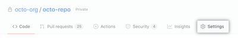
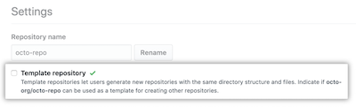
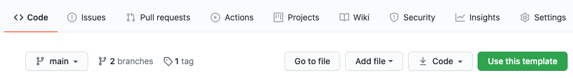
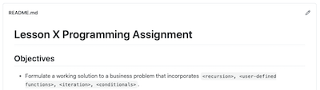
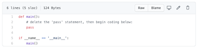
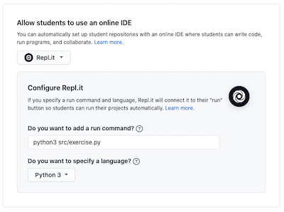

# Using this template
    
> This is a master template for creating autograded Python assignments. To use this template for your GitHub assignments, follow these steps in order:

   1. Clone this repository (Master Assignment Template)
   2. Create your own repository  
   3. Create an assignment in GitHub

## Clone this repository

> You only need to complete this step one time. This will give you your own copy of this master template. You will use your own copy as a template each time you create an assignment repositories.

1. Navigate to [https://github.com/Professor-Ruiz/master-assignment-template/generate](https://github.com/Professor-Ruiz/master-assignment-template/generate)    
2. Name your repository, then click ***Begin Import***
3. Make your copy of ***master-assignment-template*** a template:
    - Open your ***master-assignment-template*** repository
    - Click the ***Settings*** tab in the upper right corner:
    
      
      
    - Click the ***Template repository*** checkbox
    
      

## Create a new repository

> For each assignment you'd like to create in GitHub classroom, create a new repository using your own copy of master-assignment-template as the template.

1. Open your copy of ***master-assignment-template***
2. Press the green ***Use this template*** button to generate a clone

   
3. Name your repository, then click ***Begin Import***
4. Make your assignment repository a template.
5. Update the [README.md](/README.md) file. It is the directions the students will see when they accept the assignment.

    
    
6. Check [exercise.py](/src/exercise.py) to see if the student's boiler-plate code needs to be updated for this new assignment.
    - Do you need to add a user-defined function stub?
    
          
7. Will students need to import any modules into their program?
    - Example:
        ```Python
        import sys
        import NumPy
        import Tkinter
        ```
    - If yes, add those modules to [line 28](/.github/workflows/workflow.yml#L28) of the workflow.yml file
        ```yml
        pip install pytest flake8 sys NumPy Tkinter
        ```
8. Choose the tests you'll use to autograde student submissions by opening [this page](/docs/testing-options.md) (Here's [another link](https://github.com/Professor-Ruiz/master-assignment-template/blob/main/docs/testing-options.md)).  I've already pre-written the tests so they'll run automatically with each student submission.

9. Delete the [docs folder](/docs) and all the files contained therein (including this file). These files are only meant for teachers, and are not meant to be included in any assignment you make for your students.
        
## Create an assignment in GitHub
> Once you've created an assignment repository template, you can create an assignment.

1. When the ***Select a repository*** pull-down menu appears, find the assignment repository you just created.
2. The Run command is ```python3 src/exercise.py```
3. If you want your students to use Repl.it for this assignment, enter this Repl.it configuration:

        
4. Do not use any additional testing or automatic grading for the assignment.

## A note on repl.it
> Repl.it's Free accounts do not allow students to import assignments (repositories) set to "Private" visibility. However, When assignments are set to "public" visibility, students will have access to each other's solutions. This may cause issues with plagiarism.
>
> I made a quick assignment for my students to claim their free "Hacker" level Repl.it accounts. I made [this video](https://youtu.be/ZqzVN47oVr0) to walk them through the process.
